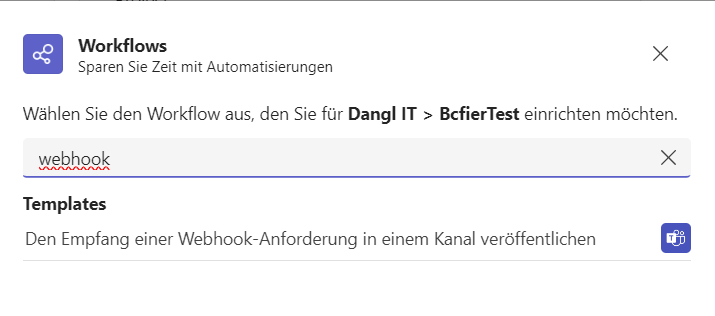

[Documentation](https://docs.dangl-it.com/Projects/IPA.BCFier)

## Intro

BCFier is an extendible and Open Source BCF client. Like IFC is the open standard for Building Information models, [BCF](https://github.com/BuildingSMART/BCF-XML) is the open standard for Building Issues. BCFier is a set of plugins and standalone apps (modules) that handle BCF and integrate directly with BIM tools.

Currently BCFier is composed of the following modules:
- Autodesk Revit addin
- Standalone Windows Viewer

Ready to start developing BCFier? Keep reading!

**If you are looking for a Guide on how to use the installed version of BCFier instedad, refer to the [UserGuide](http://bcfier.com/userguide/)**

This project is a fork of the original BCFier project by Matteo Cominetti.

## Local Development

For **Revit** and **Navisworks**, the best way to launch the plugin in development mode is to use the `AddinManager´ extension.

To run the frontend part, you should run these commands then:
* **Revit**
  `electronize start /watch /args --revit-integration --app-correlation-id="3136262a-5f6b-41b0-ba89-6a8c4212b699"`
* **Navisworks**
  `electronize start /watch /args --navisworks-integration --app-correlation-id="65ef2104-64ca-4390-bae3-3de4901a53dc"`

Those ids are hardcoded when you're running a `Debug` build, and allow you to launch the app and the actual plugin independently of eachother.

## Teams Webhooks

When configuring projects, you can set up a webhook to a Microsoft Teams channel. This will send notifications to the channel when new issues are created or updated. Webhooks must be created via Teams workflows. To do this, follow these steps:

1. Go to the channel you want to receive notifications in and select the _Workflows_ setting:
   
2. Create a new webhook:
   
3. Configure the webhook
3. After creating the webhook, you can use its url in the project configuration

## License
GNU General Public License v3 Extended
This program uses the GNU General Public License v3, extended to support the use of BCFier as Plugin of the non-free main software Autodesk Revit.
See <http://www.gnu.org/licenses/gpl-faq.en.html#GPLPluginsInNF>.

Copyright (c) 2013-2024 Matteo Cominetti & Georg Dangl

This program is free software: you can redistribute it and/or modify
it under the terms of the GNU General Public License as published by
the Free Software Foundation, either version 3 of the License, or
(at your option) any later version.

This program is distributed in the hope that it will be useful,
but WITHOUT ANY WARRANTY; without even the implied warranty of
MERCHANTABILITY or FITNESS FOR A PARTICULAR PURPOSE.  See the
GNU General Public License for more details.

You should have received a copy of the GNU General Public License
along with this program.  If not, see <http://www.gnu.org/licenses/gpl.txt>.
